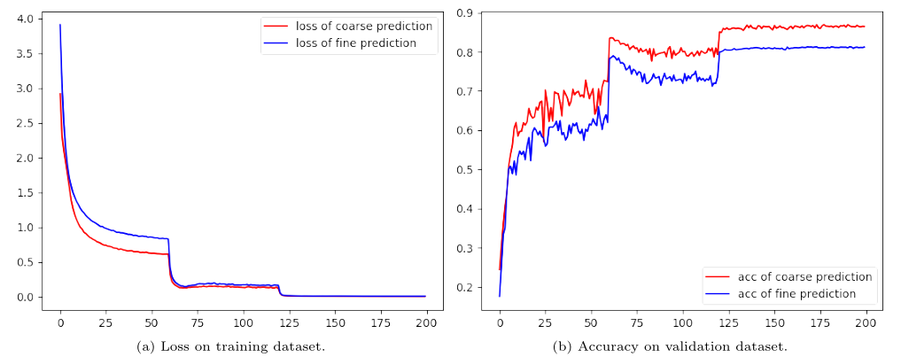
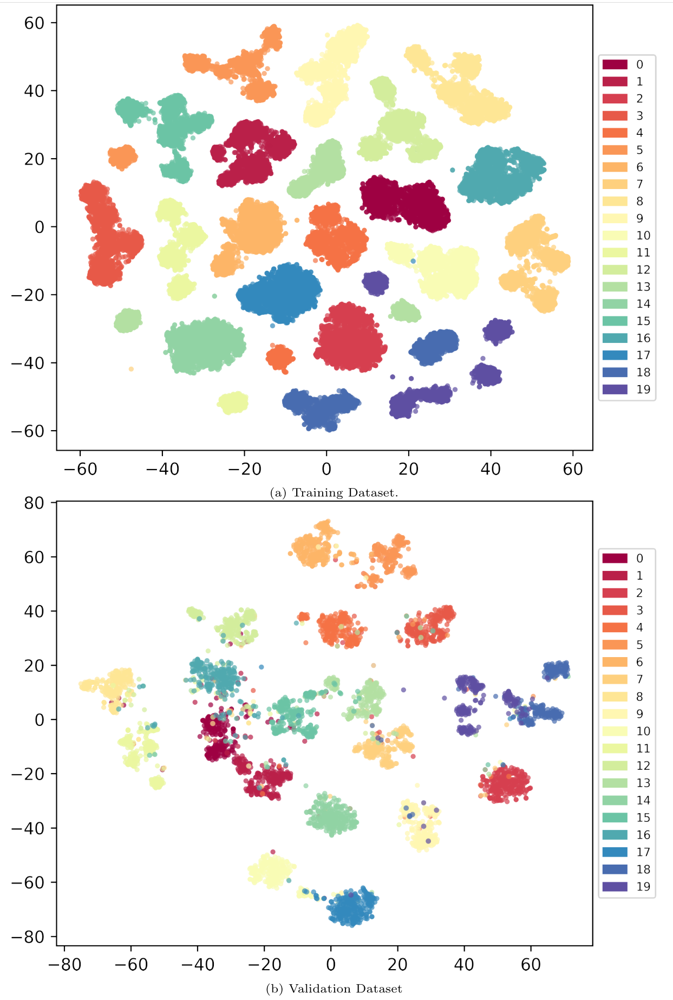

# Image classification on CIFAR

Several attempts on CIFAR using pytorch

## Requirements

* python3.7
* pytorch1.6.0+cu101
* ......

See requirements.txt for more details.

## Models

We provide several alternative models including Resnet, WideResnet and Multi-WideResnet. Multi-WideResnet  is similar to FPN by concatenating the features from all layers, which may slightly improve the performance of baseline models.

## Training and Evaluation

For training WideResnet40-10, using 

```
bash train_wide_resnet.sh
```

For evaluation, using

```
bash eval.sh
```

## Results

The models are trained with 200 epoch and 0.2 learning rate decay ratio of 60, 120, 160 epoch. For pretrained models on ImageNet, traing process is set to 30 epoch with 0.001 lr. Top1 and Top5 are provided.

* Top1 and Top5 accuracy:


​	Pretrained, A BIG WIN!

* Loss and accuracy curves:



* Visualization with t-SNE

  
